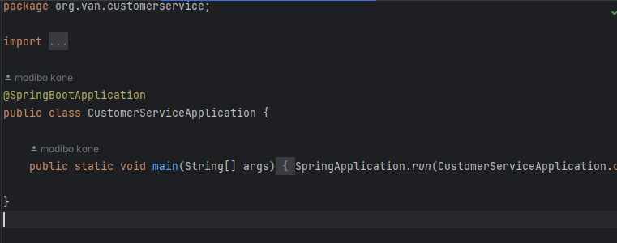
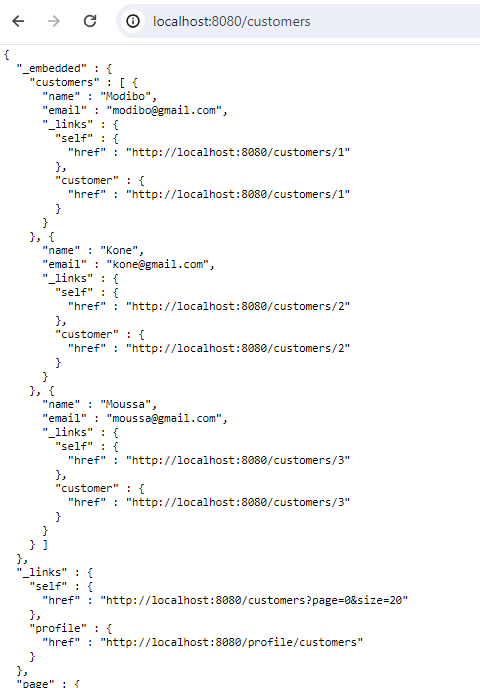
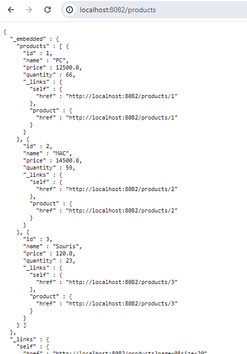

# SPRING CLOUD

## 1- Custormer Service:

- Creation de customer-service

- Customer Class:

- Customer Repo:

- Instation Customers

- Test Customer Rest API:

## 2- Inventory Service

- Creation de inventory-service
  

- Product Class:
  

- Product Repo:
  

- Instation Products

- Test Product Rest API:
  
## 3 -Creation GateWay

## 4- Gateway Static Configuration 
 - config static

 - Test de l'interface Customer de la gateway:
  
 - Test de l'interface Product de la gateway:

## 